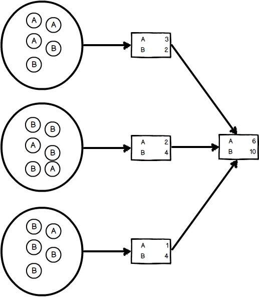

### Map/Reduce

#### Example

##### Elections

When a small group of people want to have an election where the vote is secret,
each will write down their choice and then all are counted.

This however does not work well for large groups of people, since it will take
a long time for everyone to vote and then count the results. Luckily, this is
a problem that current countries had figured out: they divide the people in
groups, each group will vote, a group member will count the results
and add them up in a single sheet of paper. All those sheets of paper are
then sent to a central person who adds up the votes to find the winner.

The act of counting each individual vote and write down the results is called
"map", while adding them up is called "reduce".

#### Properties

The benefit of map/reduce is to divide a big problem into smaller ones that can
be done at the same time, and then use the results of each to get the general
result.
