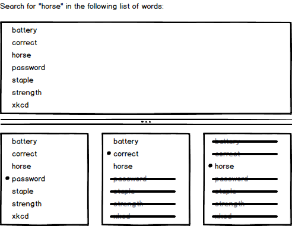

### Binary Search

#### Example

##### Dictionary

A person wants to look for a word in an English dictionary that does not have
an index.
They may open the book in a random page, select any word in it and compare it
with the word they are looking for. Since the words are sorted alphabetically,
they know in which direction to proceed. They can now repeat this process
until finding the desired word.

Repeating these steps will bring the desired word sooner or later. But if
instead of comparing any random word, they compare with the word that is
exactly in the middle of the valid range, the number of required comparisons
is minimized.

#### Guess Who?

The same algorithm can be applied to the children's game Guess Who?. The
optimal strategy is to ask a question that will discard half of the options.

Going to the opposite extreme by asking a very specific question is a
high-risk, high-rewards scenario. It is very likely to obtained little
information in most cases, and a lot in a few.

#### Properties

Binary Search is a series of steps that we can do to search for a result in a
collection. It is called binary because after each step, we should be able to
remove roughly half of the items in the collection.

In general, it is used on a series of sorted items, like words or numbers.
But the same idea can be used for any search problem that allows to discard
half of the possible results.

Since half of the options are removed after each comparison, it is pretty fast
to find what we are looking for in not so many iterations. For a million
options, we can locate any one in up to twenty comparisons. And for a billion,
up to 30.
