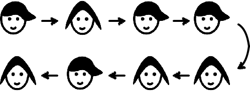

### Linked List

#### Example

##### Field trip

In a school field trip, stand all children in a line and ask them to remember
who is to their right. Now, you remember who is in each of the edges.

Now at any point, you can ask the first child to point to the second, and then
ask the second for the third, and so on. If you reach the last child then you
are sure that your list is complete.

#### Properties

In this schema, it is easy to add something at any point in the list. If the
list is sorted by some criteria, you can find where the insertion needs to
happen and just ask the previous node to point to the new value and the
new value to what the node was pointing at.

It is hard, though, to identify a node by its position. If you want to know
the position of a node, you have to start from the first and count until you
reach it.
