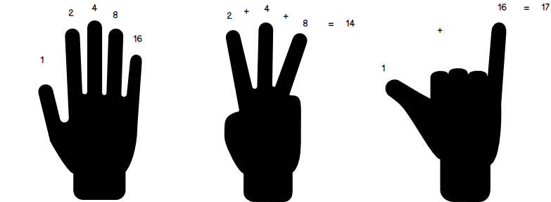

### Encoding

#### Example

##### Finger counting

When people learn to count, they intuitively use their hand. Each finger that
is lifted counts as one, then lifting three fingers represent the number three.

If we want to count to larger numbers we will run out of fingers when we reach
ten. But we can assign different values to each one and the count to over one
thousand.

For example, in our left hand the thumb can be worth one, the index finger
can be two, the middle one four, the ring one eight and the pinky sixteen.

Now if we want to represent the number fourteen, we can lift the our three
middle fingers.

Hands made by [Freepik](http://www.freepik.com) from
[www.flaticon.com](http://www.flaticon.com). Licensed under
[CC BY 3.0](http://creativecommons.org/licenses/by/3.0/).

#### Properties

To successfully encode and decode a value, it is necessary to agree on a
representation. And the sender needs to know how to create this representation
for any value, while the receiver needs to know how to read it to get the
value.
